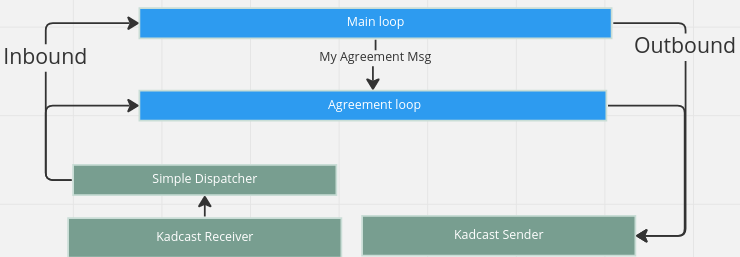

# Consensus Protocol

The Dusk Network utilizes a consensus protocol called Succinct Attestation (SA). SA is a permissionless proof-of-stake (PoS) consensus mechanism that provides statistical finality guarantees[^1]. SA belongs to the committee-based PoS category[^2] because it uses committees to finalize blocks for a given round.

SA is permissionless, meaning that any eligible participant in the Dusk Network protocol can join and participate in the consensus process. To be eligible, a participant must meet the following requirements:

 - Have a pre-configured amount of DUSK locked as a stake (referred to as a _Provisioner_)
 - Have a stake with a maturity of at least two epochs (referred to as an _Eligible Provisioner_)

The SA consensus is divided into _rounds_, each of which creates a new block. In turn, in each round, one or more _iterations_ of the following _phases_ are executed:

  1. _Proposal_: in this phase, a _generator_, extracted from the _Eligible Provisioners_, creates a new candidate block $B$ for the current round, and broadcasts it to the network;
  
  2. _Validation_: in this phase, the members of a _committee_, extracted from the _Eligible Provisioners_, vote on the validity of the candidate block $B$; 
  if votes reach a quorum of $2/3$ (i.e., 67% of the committee), the validation outputs $B$, otherwise NIL;

  3. _Ratification_: in this phase, if the output of the Validation is not NIL, a second _committee_, also extracted from the _Eligible Provisioners_, vote on the candidate block $B$;
  if votes reach the quorum, an quorum message (containing the votes of the two Validation and Ratification phases) is broadcast;

Note: the extraction process, used in the all phases, is implemented using the _Deterministic Sortition_ algorithm [^3]. 


# Repository structure

## Consensus crate
A full implementation of SA mechanism.

# Implementation details
The implementation of *SA* consists of two main `tokio-rs` tasks, the `Main_Loop` and `Quorum_Loop`, which communicate with external components through message queues/channels. The protocol parameters for *SA* are located in `src/config.rs`.

 

## How to use (example code)
```rust
let mut consensus = Consensus::new(
	// Inbound messages for Main Loop
	inbound_msgs,
	// Outbound messages for Main Loop
	outbound_msgs,
	// Inbound messages for Quorum Loop
	quorum_inbound_queue,
	// Outbound messages for Quorum Loop
    quorum_outbound_queue,
	// Implements Operations trait
	Arc::new(Mutex::new(crate::mocks::Executor {})),
	// Implements Database trait
	Arc::new(Mutex::new(crate::mocks::SimpleDB::default())),
);

let mut most_recent_block = Block::default();

loop {
	/// Provisioners list is retrieved from contract storage state.
	let provisioners = rusk::get_provisioners();

	// Round update is the input data for any consensus round execution.
	// Round update includes mostly data from most recent block. 
	let round_update = from(most_recent_block);

	/// Consensus::Spin call initializes a consensus round
	/// and spawns main consensus tokio::tasks.
	let ret = consensus.spin(
			round_update
			provisioners,
			cancel_rx,
		)
		.await;

	/// Consensus spin output/ret can be a winner block or an error. 
	match ret {
		Ok(winner_block) => { 
			println!("new block produced");
		}
		Err(_) => {
			// Cancelled from outside by cancel_rx chan.
			// Max Step Reached - happens only if no consensus is reached for up to 213 steps/71 iterations.
		}
	}
	most_recent_block = winner;

	/// Internally, consensus instance may accept future messages for next round. 
	/// They will be drained on running the round, that's why same consensus instance is used for all round executions.
}
```

# Build, Run and Test
```bash
# Run unit tests
cargo test
```

```bash
# Build consensus
cargo b --release
```

[^1]: A finality guarantee that is achieved through the accumulation of blocks over time, such that the probability of a block being reversed decreases exponentially as more blocks are added on top of it. This type of guarantee is in contrast to absolute finality, which is achieved when it is mathematically impossible for a block to be reversed.
[^2]: A type of Proof-of-Stake consensus mechanism that relies on a committee of validators, rather than all validators in the network, to reach consensus on the next block. Committee-based PoS mechanisms often have faster block times and lower overhead than their non-committee counterparts, but may also be more susceptible to censorship or centralization.
[^3]: <!-- TODO: add short description here --> Deterministic Sortition is described [here](https://wiki.dusk.network/en/deterministic-sortition). 
[^4]: Kadcast is a decentralized protocol used for efficient communication between nodes in a network. It is based on the Kademlia algorithm and maintains a routing table to find the best path to another node. Kadcast is commonly used in decentralized systems, such as decentralized applications (DApps) and decentralized file sharing systems, to send messages and data between nodes in a fast and reliable manner. One of the main advantages of Kadcast is its decentralized nature, which makes it resistant to censorship and other forms of interference, making it a popular choice for applications that require decentralization. Please find the whitepaper [here](https://eprint.iacr.org/2021/996). Dusk's implementation can be found [on its repo](https://github.com/dusk-network/kadcast).

## Release History

To see the release history for this crate, please see the [CHANGELOG](./CHANGELOG.md) file.

## License

This code is licensed under the Mozilla Public License Version 2.0 (MPL-2.0). Please see the [LICENSE](./LICENSE) for further details.
